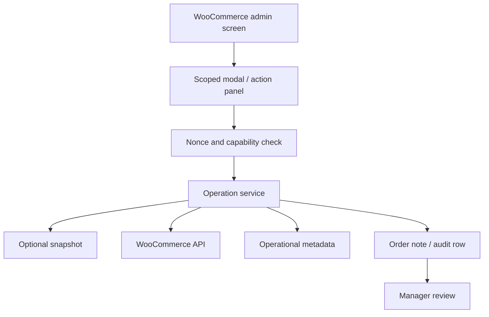

# A2 WooCommerce Admin Ops Toolkit

Public-safe case study for WooCommerce admin tooling around exceptional order workflows, operational flags, controlled edits, and audit-friendly productivity improvements.

## Reviewer Shortcut

This repo demonstrates WooCommerce admin tooling as operational infrastructure, not just backend convenience UI. It relates to exceptional order workflows where staff need controlled mutations, snapshots, audit records, and rollback thinking. It proves permission gates, validation, operation services, auditability, and partial-failure handling. Start with `docs/infrastructure`, `docs/engineering-notes`, and `samples/infrastructure`. This is a showcase repository, not a production package.

## Overview

Commerce operations often break down in the admin area, not the storefront. Teams need to replace items, correct operational details, review stock context, export cleaner data, and handle exceptions without weakening order integrity.

## Production Context

- Staff needed tools for exceptional order and product workflows.
- Operations had to stay separate from payment gateway behavior.
- Admin scripts had to load only where needed to avoid collisions.
- Every write needed capability and nonce protection.

## Problem

Manual admin work was slow and error-prone. WooCommerce provides a flexible backend, but exceptional workflows need guardrails, snapshots, audit notes, and narrow UI surfaces.

## Operational Constraints

- Do not alter payment status or gateway callbacks accidentally.
- Do not expose private order/customer data in public samples.
- Keep admin assets scoped to relevant screens.
- Preserve traceability for changes that affect operations.

## Scaling Challenges

- Admin pages become fragile when too many plugins load scripts globally.
- Manual corrections increase risk as order volume grows.
- Operational data should be visible to staff without expanding full edit permissions.
- Exceptional workflows need undo thinking because mistakes are expensive.

## Architecture Decisions

- Use admin-only controllers and capability checks.
- Keep operation logic in services, not UI handlers.
- Store operational flags separately from sensitive payment/customer data.
- Add audit notes for important actions.
- Use snapshots where a change needs rollback support.

## Admin Workflow

## Tradeoffs

- Admin tools reduce repetitive work but must avoid hiding important WooCommerce state.
- Separate operational metadata keeps payment data safer but adds another read path.
- Snapshots add storage overhead but make recovery possible.
- Narrow asset loading reduces conflicts but requires careful screen detection.

## Failure Prevention

- Capability checks before writes.
- Nonce validation on admin actions.
- Screen-level asset loading.
- No gateway status changes in operational tools.
- Audit notes for traceable changes.
- Snapshot/undo pattern for higher-risk edits.

## Performance Strategy

- Avoid global admin script loading.
- Keep modal data fetches bounded.
- Use direct repository reads for operational tables when WooCommerce object loading is unnecessary.
- Separate export/reporting paths from order edit interactions.

## Operational Learnings

- Internal tools need to make the safe path the fastest path.
- Admin UX is production infrastructure when staff depend on it daily.
- The most useful operation tools are usually narrow, boring, and reliable.

## Future Improvements

- Add sanitized screenshots of modal flows.
- Add public fixtures for capability and nonce checks.
- Add a changelog for admin workflow patterns.

## Code Samples

- admin controller;
- operation service;
- repository layer;
- audit logger.

## Engineering Notes

- [Admin tools as operational infrastructure](docs/engineering-notes/admin-tools-as-operational-infrastructure.md)
- [Safe admin actions and rollback thinking](docs/engineering-notes/safe-admin-actions-and-rollback-thinking.md)

## Infrastructure Notes

- [Request lifecycle](docs/infrastructure/request-lifecycle.md)
- [Observability and instrumentation](docs/infrastructure/observability-and-instrumentation.md)
- [Failure mode matrix](docs/infrastructure/failure-mode-matrix.md)
- [Infrastructure samples](samples/infrastructure)

## Quality Signal

- [Quality signal notes](docs/quality-signal.md)
- [Sample PHP syntax workflow](.github/workflows/sample-php-lint.yml)
- [Samples directory](samples)

## Security & Privacy Notes

No real order data, customer data, payment logic, private meta keys, gateway details, or internal business workflows are included.

## Tech Stack

PHP, WordPress, WooCommerce, MySQL, JavaScript, admin AJAX/REST.

## Related Portfolio

- Portfolio: https://amiraliyaghouti.com
- Projects: https://amiraliyaghouti.com/projects.html
- Case studies: https://amiraliyaghouti.com/case-studies.html
- GitHub profile: https://github.com/shiny-a2
