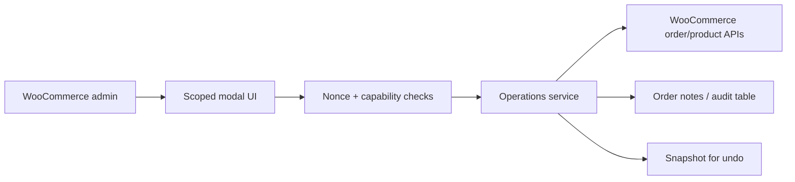

# A2 WooCommerce Admin Ops Toolkit

## Overview

Public showcase for WooCommerce admin operation tools that help teams handle exceptional order and catalog workflows with better control, validation, and auditability.

## Problem

Commerce teams often need to correct order items, update operational fields, review product data, and handle exceptional sales cases. Doing this directly in WooCommerce without guardrails increases mistakes and slows operators down.

## Technical Approach

- Admin-only screens and modals scoped to the relevant WooCommerce contexts.
- Capability checks and nonce validation for every write.
- Operational flags stored separately from sensitive order/payment data.
- Snapshot/undo pattern for risky changes.
- Clear audit notes for human review.

## Key Features

- Order operation tools
- Admin modal workflows
- Operational flags
- Internal WooCommerce productivity tooling
- Validation and audit notes

## Performance / Business Impact

Business value: reduced repetitive admin work, improved control over product/order data, and lowered the risk of manual mistakes in catalog and order operations.

## Architecture

## Code Samples

- `samples/sample-admin-page.php`

## Security & Privacy Notes

Samples do not include real order metadata, payment logic, customer records, or private business workflows.

## Tech Stack

PHP, WordPress, WooCommerce, MySQL, JavaScript, admin AJAX/REST.

## Related Links

- Portfolio: https://amiraliyaghouti.com
- GitHub profile: https://github.com/shiny-a2

