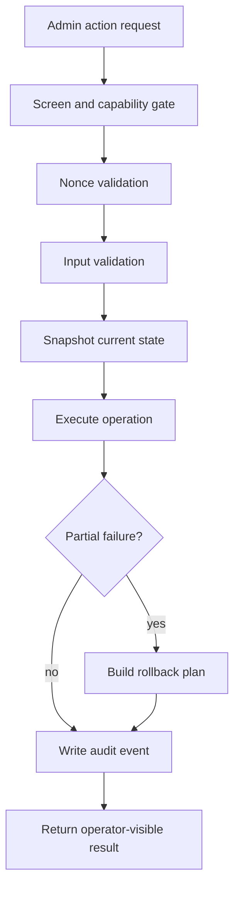

# Request Lifecycle

Admin operation requests are controlled mutation paths. The important work is deciding whether the mutation is allowed, reversible, and auditable.

## Operating Notes

- The UI should not be trusted as the only guard.
- Snapshots are needed before higher-risk mutations.
- Audit records should be written for state-changing actions.
- Payment and gateway state should stay outside ordinary operational tools unless explicitly designed.

